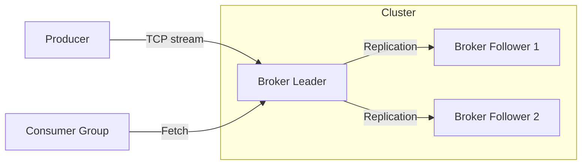

<div align="center">
  <h1>Distributed Event Streaming Platform</h1>
  <p><b>High-throughput, fault-tolerant message broker implemented in Rust.</b></p>
  
  <p>
    
    
  </p>
</div>

---

## 📖 Overview

A bespoke distributed event streaming platform designed for ultra-low latency and high-throughput data pipelines. Inspired by Apache Kafka and Redpanda, this broker is implemented entirely in Rust utilizing asynchronous I/O via the Tokio runtime.

## ✨ Architecture & Consensus



## 🚀 Features

- **Asynchronous Core:** Built on `tokio` for handling tens of thousands of concurrent connections.
- **Append-Only Log:** High-performance disk persistence strategy mimicking LSM trees.
- **Memory Efficiency:** Zero-copy serialization strategies utilizing standard Rust ownership models.

## 🛠️ Usage

```bash
cargo build --release
cargo run --release
```
